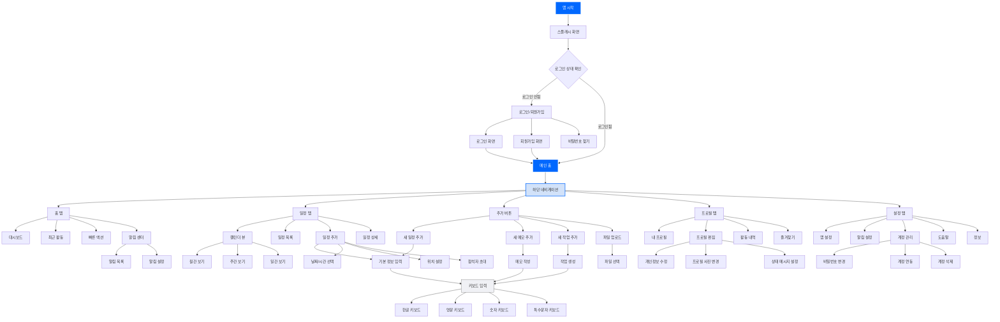

```mermaid
graph TD
    A["앱 시작"] --> B["스플래시 화면"]
    B --> C{"로그인 상태 확인"}
    
    C -->|로그인 안됨| D["로그인/회원가입"]
    C -->|로그인됨| E["메인 홈"]
    
    D --> D1["로그인 화면"]
    D --> D2["회원가입 화면"]
    D --> D3["비밀번호 찾기"]
    D1 --> E
    D2 --> E
    
    E --> F["하단 네비게이션"]
    
    F --> G["홈 탭"]
    F --> H["일정 탭"]
    F --> I["추가 버튼"]
    F --> J["프로필 탭"]
    F --> K["설정 탭"]
    
    G --> G1["대시보드"]
    G --> G2["최근 활동"]
    G --> G3["빠른 액션"]
    G --> G4["알림 센터"]
    
    H --> H1["캘린더 뷰"]
    H --> H2["일정 목록"]
    H --> H3["일정 추가"]
    H --> H4["일정 상세"]
    H1 --> H5["월간 보기"]
    H1 --> H6["주간 보기"]
    H1 --> H7["일간 보기"]
    
    I --> I1["새 일정 추가"]
    I --> I2["새 메모 추가"]
    I --> I3["새 작업 추가"]
    I --> I4["파일 업로드"]
    
    J --> J1["내 프로필"]
    J --> J2["프로필 편집"]
    J --> J3["활동 내역"]
    J --> J4["즐겨찾기"]
    
    K --> K1["앱 설정"]
    K --> K2["알림 설정"]
    K --> K3["계정 관리"]
    K --> K4["도움말"]
    K --> K5["정보"]
    
    G4 --> N1["알림 목록"]
    G4 --> N2["알림 설정"]
    
    H3 --> M1["기본 정보 입력"]
    H3 --> M2["날짜/시간 선택"]
    H3 --> M3["위치 설정"]
    H3 --> M4["참석자 초대"]
    
    I1 --> M1
    I2 --> M5["메모 작성"]
    I3 --> M6["작업 생성"]
    I4 --> M7["파일 선택"]
    
    M1 --> KB["키보드 입력"]
    M5 --> KB
    M6 --> KB
    
    KB --> KB1["한글 키보드"]
    KB --> KB2["영문 키보드"]
    KB --> KB3["숫자 키보드"]
    KB --> KB4["특수문자 키보드"]
    
    J2 --> P1["개인정보 수정"]
    J2 --> P2["프로필 사진 변경"]
    J2 --> P3["상태 메시지 설정"]
    
    K3 --> A1["비밀번호 변경"]
    K3 --> A2["계정 연동"]
    K3 --> A3["계정 삭제"]
    
    style A fill:#0068fe,stroke:#fff,stroke-width:2px,color:#fff
    style E fill:#0068fe,stroke:#fff,stroke-width:2px,color:#fff
    style F fill:#d2e2f9,stroke:#0068fe,stroke-width:2px
    style KB fill:#f0f1f5,stroke:#6a6a6a,stroke-width:1px
```